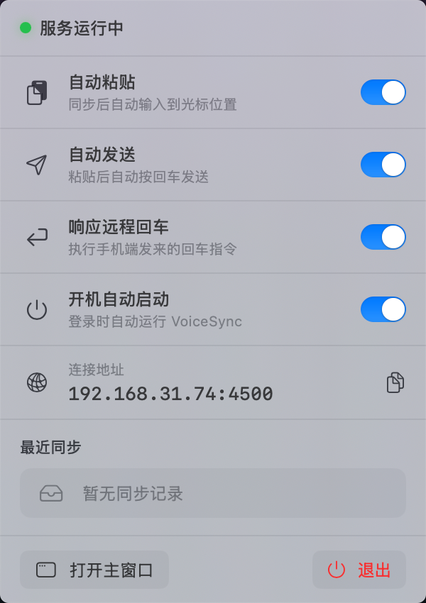
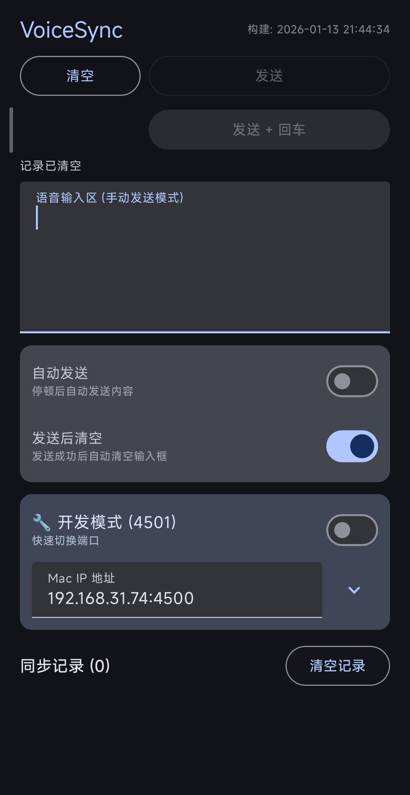

# 🎙️ VoiceSync

**让手机的语音识别，为电脑打字。**

一款专为中文语音输入优化的跨设备同步工具，完美解决"手机语音输入法好用、电脑端体验差"的痛点。

> **效率提升数据**：如果你每天需要向 AI 或其他应用输入 3000 字（约 10-15 次对话），使用 VoiceSync + 豆包输入法的语音识别（~180 字/分钟）相比传统打字（~60 字/分钟），**每天可节省 30-40 分钟**，效率提升超过 **10 倍**。一年下来，相当于多出 **200+ 小时**的生产时间。

---

## � 应用截图

### Mac 端界面

Mac 端提供简洁直观的界面，实时显示同步状态和历史记录。支持菜单栏常驻模式，不干扰日常工作。

  
  
<i>Mac 端主界面：实时显示设备信息、同步历史和配置选项</i>

### Android 端界面

Android 端采用全屏输入设计，启动即可唤起豆包输入法进行语音输入，操作流畅便捷。

  
  
<i>Android 端界面：全屏输入区域，支持语音识别与文字同步</i>

---

## �💡 创作背景

有一个叫**豆包输入法**的神器，它的语音识别模型非常强大，识别准确率和速度都远超其他输入法。但问题来了：

- **PC 端语音输入体验不佳**：要么是专业语音识别软件太贵，要么是免费方案延迟高、准确率低
- **手机天然适合做语音输入设备**：手机放在旁边，随时拿起来说话，比对着电脑麦克风更自然
- **豆包输入法只在手机端好用**：PC 版要么没有，要么体验远不如手机

所以我开发了 **VoiceSync**：**在手机上用豆包输入法的语音能力说话，文字自动同步到电脑剪贴板**，还能设置自动回车、自动发送等功能，彻底解放双手。

---

## 🎯 核心功能

### Android 端（语音输入端）

- ✅ **全屏输入区**：启动即聚焦，直接唤起豆包输入法语音输入
- ✅ **智能自动发送**：停止说话 2 秒后，自动将文字发送到电脑
- ✅ **自动清除内容**：发送成功后 3 秒内无操作，自动清空输入框，准备下一次输入
- ✅ **自动回车控制**：可设置同步时是否在电脑端自动按下回车键
- ✅ **IP 地址历史**：自动记录所有连接过的电脑 IP，快速切换设备
- ✅ **手动发送/清除**：保留手动控制按钮，随时干预

### Mac 端（接收端）

- ✅ **HTTP 监听服务**：后台运行，实时接收手机发来的文字
- ✅ **剪贴板自动注入**：收到文字后立即更新系统剪贴板，直接 `Cmd+V` 粘贴
- ✅ **自动粘贴功能**：可选自动模拟 `Cmd+V`，文字直接出现在当前光标位置
- ✅ **响应远程回车**：可选是否执行手机端发来的回车指令
- ✅ **同步历史记录**：界面展示所有同步记录，防止被后续剪贴板操作覆盖
- ✅ **菜单栏模式**：隐藏主窗口，常驻菜单栏运行

---

## 🚀 使用场景

1. **写文章/写代码注释**：手机放在旁边，想到什么说什么，文字自动出现在编辑器里
2. **回复微信/邮件**：用豆包快速说一段话，自动粘贴到聊天框
3. **记录灵感**：随时拿起手机说话，内容自动同步到电脑的笔记软件
4. **会议记录**：边开会边用手机语音输入，文字实时同步到电脑文档

---

## 📦 安装与配置

### 1. Mac 端配置

1. 下载并运行 `VoiceSyncMac.app`
2. 首次启动会提示需要以下权限：
   - **网络连接权限**：接收手机发来的数据
   - **辅助功能权限**（可选）：如果需要自动粘贴功能，需要授予此权限
3. 查看应用界面显示的**本机 IP 地址**（例如 `192.168.1.100`），记录下来
4. 应用会自动在 `4500` 端口监听

### 2. Android 端配置

1. 安装 `VoiceSyncAndroid.apk`
2. 打开应用后，点击右上角**设置图标**
3. 输入刚才记录的 Mac IP 地址（例如 `192.168.1.100`）
4. 确保手机和电脑连接在**同一个 Wi-Fi 网络**

### 3. 开始使用

1. 在手机上打开 VoiceSync 应用
2. 点击输入框，会自动弹出键盘
3. 切换到**豆包输入法**，点击语音输入按钮
4. 说话即可，停止 2 秒后自动发送到电脑
5. 在电脑上按 `Cmd+V`（或开启自动粘贴），文字直接出现

---

## ⚙️ 高级设置

### Android 端

- **自动发送延迟**：调整停止输入多久后自动发送（默认 2 秒）
- **自动清除延迟**：调整发送后多久自动清空输入框（默认 3 秒）
- **自动回车开关**：控制同步时是否让电脑自动按回车
- **自动发送开关**：关闭后需要手动点击发送按钮

### Mac 端

- **自动粘贴开关**：是否自动模拟 `Cmd+V` 粘贴到当前应用
- **响应远程回车开关**：是否执行手机发来的回车指令
- **历史记录**：查看所有同步过的文字，点击可重新复制

---

## 💡 Tips

### Mac 权限问题排查

如果你发现**辅助功能权限**明明已经给了但还是不生效，尝试以下步骤：

1. 打开 `系统设置` → `隐私与安全性` → `辅助功能`
2. 找到 `VoiceSyncMac.app` 所在的文件夹（右键应用 → `显示包内容`）
3. 在权限列表中**先删除** VoiceSyncMac
4. 然后重新将应用**拖入**权限列表
5. 重启应用

这似乎是 macOS 的一个 bug，重新添加可以刷新权限状态。

### 连接失败排查

- 确认手机和电脑在**同一个 Wi-Fi** 下
- 检查 Mac 防火墙是否阻止了端口 4500
- 尝试在 Mac 终端运行：`lsof -i :4500` 检查端口是否被占用
- 确认 IP 地址填写正确（不要加 `http://` 前缀）

---

## 🛠 技术栈

- **Mac 端**：SwiftUI + Swifter（HTTP 服务器）
- **Android 端**：Kotlin + Jetpack Compose + Ktor（HTTP 客户端）
- **通信协议**：HTTP JSON（局域网通信）

---

## 📋 开发计划

- [x] Android 到 Mac 基础同步
- [x] 自动发送与自动清除
- [x] 剪贴板自动注入
- [x] 自动粘贴（模拟快捷键）
- [x] 同步历史记录
- [x] 菜单栏常驻模式
- [ ] mDNS 自动发现设备（无需手动输入 IP）
- [ ] iOS 版本支持

---

## 📄 许可证

MIT License

---

## 🙋 FAQ

**Q: 为什么不直接用电脑的语音输入？**  
A: 豆包输入法的语音模型在中文场景下识别率极高，而且手机拿起来说话比对着电脑麦克风更自然。

**Q: 数据安全吗？**  
A: 所有数据都在局域网内传输，不经过任何服务器，完全私密。

**Q: 可以用其他输入法吗？**  
A: 当然可以！只要是 Android 上的任何输入法都可以用，豆包只是我个人最推荐的。

**Q: 支持 Windows 吗？**  
A: 目前只支持 Mac，未来可能会考虑 Windows 版本。
